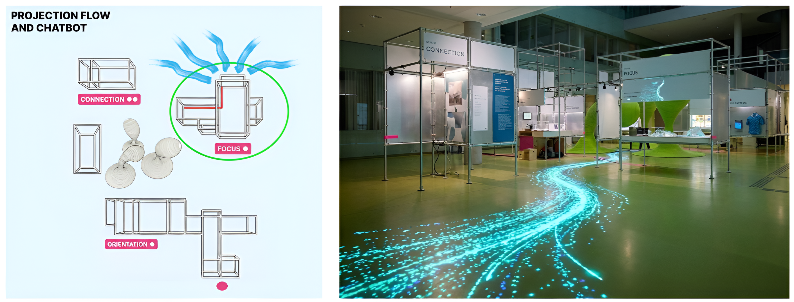
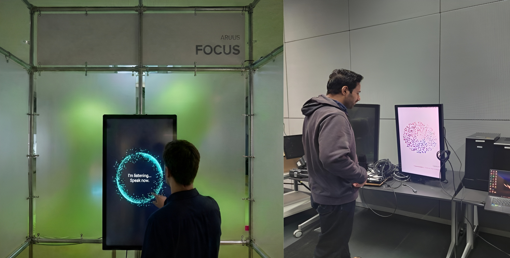
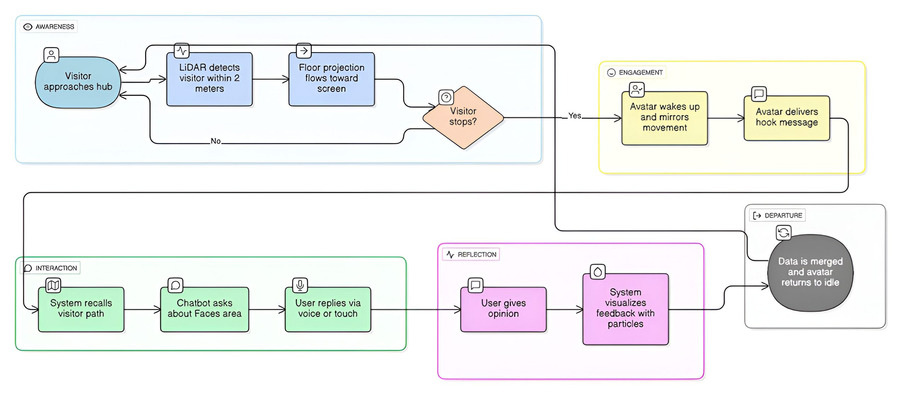
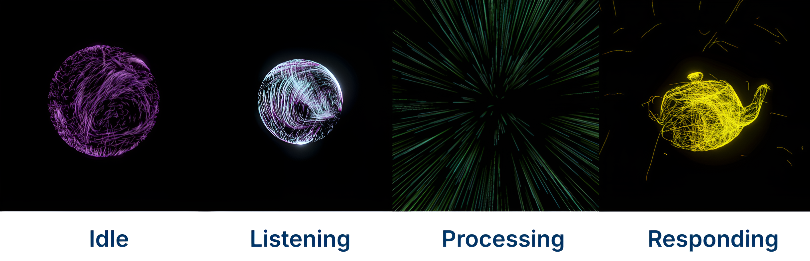

## The Experimental Media Lab - Co-lab with Technische Design

## Chatbots in Science Communication

**Group 3: //Data Spaces - Experience Science**
**Ruben Pratzka, Sayandip Srimani, Mohammad Elahi**

##Task:

- Develop a chatbot prototype to guide visitors at the //DataSpaces exhibition on the topic of complex systems.
- The goal is to inform visitors about the working of such systems, where they are used and what their impact is.
- The chatbot is also intended to encourage visitors to share their thoughts, questions, and assessments of the exhibits.

## Goals and steps:
- Consider how visitors to the exhibition will be made aware of your chatbot and design an Idle Mode 
- Consider how visitors interact with your chatbot (text-based, voice-based, hybrid)
- What design features (language, voice, appearance) does your chatbot use to build trust and rapport?
- Building acceptance among visitors?
- Program a chatbot prototype to collect and store feedback.
---

## Our Core Idea

- Feedback is embedded into interaction rather than requested explicitly
- The chatbot behaves as an exhibition character, not a survey interface

---
## Projection Flow and Chatbot Location

---

## Example Integration

---

## Visitor Storyline

---

## How Do We Attract Visitors?

- We rely on curiosity, not so much on instructions.
- Ambient particle projections attract peripheral attention
- The installation reacts subtly to visitor presence
- Movement and reaction guide visitors toward the chatbot
---

## Chatbot Appearance

---
## Interaction Design

- Interactions are short, simple, and low-effort
- Visitors respond through intuitive visual choices
- Interaction options are revealed progressively
- The chatbot adapts to the visitor’s level of engagement

## Example Interaction

Chatbot: “Hi, I’m Atlas! I noticed you just explored a lot of data here. I know all about this exhibition, but since I‘m not human I cannot experience it. How did this exhibition feel to you?”
On screen (and voice):
😮 Surprising 🙂 Thought-provoking 😐 Neutral

Visitor: Taps 🙂 Thought-provoking
(or says “thought-provoking”)

Chatbot: “Thought-provoking — that comes up often.”
(Particles react subtly)

Chatbot (feedback-oriented): “Would you like to leave this feeling as feedback for the exhibition?”

On screen: Yes Skip

Visitor: Yes

Chatbot: Thank you...

## Feedback Logic

- Feedback is collected through conversational interaction and lightweight ratings.
- Emotional responses are captured as high-level categories
- Feedback is linked to specific installations
- Data is aggregated to support exhibition reflection and improvement

## Next Steps

- Integrate conversational AI with a lightweight backend
- Implement core conversation logic and feedback flow
- Design and refine the user interface and visual behavior
- Connect feedback data to visualization and aggregation

## Discussion Question

- For initiating interaction: should the chatbot speak first, or should the visitor explicitly confirm via touch?
- How should we balance visibility and privacy (e.g., open setup vs. side walls)?
- Would you personally interact with such a system in an exhibition context?
- Should feedback be collected explicitly, implicitly, or as a combination of both?
- Any ideas for visualisations?
