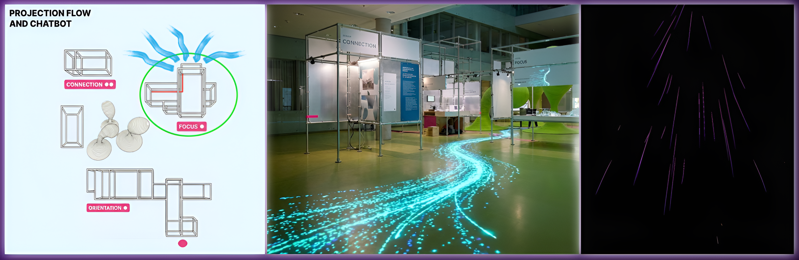
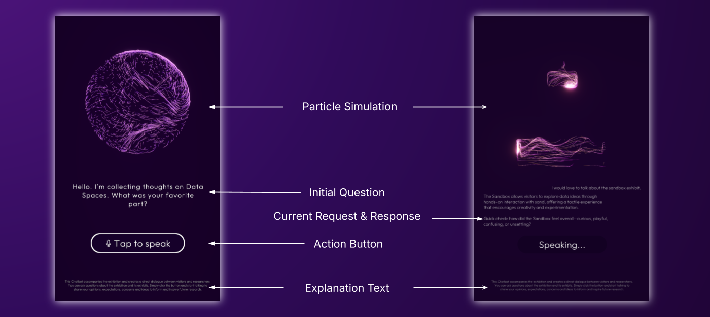
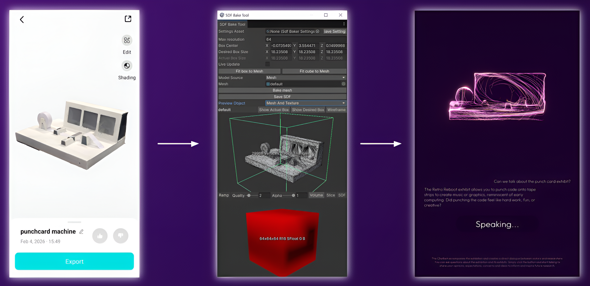
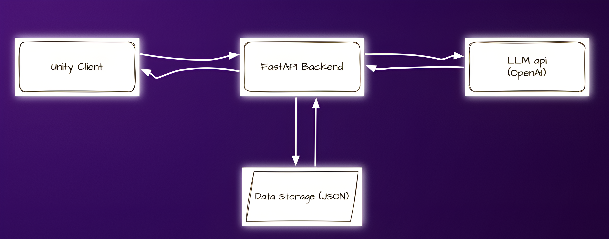
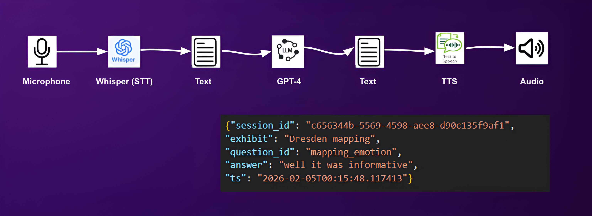
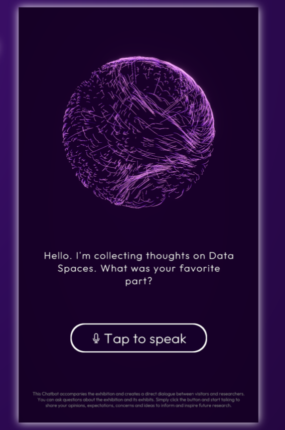

## The Experimental Media Lab - Co-lab with Technische Design

## ISL Chatbot

**Final Prototype Group 3: //DataSpaces - Experience Science**

**Members: Mohammad Elahi, Ruben Pratzka, Sayandip Srimani** 
---

# Introduction
**ISL Chatbot:A system designed to collect visitor feedback naturally in exhibition spaces**

**The Challenge:**
- Traditional feedback forms are rarely filled out by visitors
- Feedback collection in exhibitions feels unnatural and tedious

**Our Solution:**
- Integrate feedback collection directly into the exhibition experience
- Create natural, effortless conversations
- Transform feedback into a conversational interaction

**Goal:**
- A system that collects visitor feedback naturally
- Seamlessly embedded within the exhibition space
---

## Project Context

- Exhibition: Data Spaces Exhibition (TU Dresden)
- Challenge: Communicating complex scientific concepts
- Visitors: Diverse backgrounds and interests
- Problem: Traditional feedback is rarely given
---

## Project Goal

- An interactive chatbot that collects visitor feedback naturally
- Collect Feedback: Capture visitor thoughts and impressions
- For Researchers: Valuable data for exhibition improvement
- Seamless Integration: Part of the exhibition experience
---

## Initial Idea: Atlas

- Our first concept: A robotic character
- Physical Presence: Robotic appearance
- Personality: Friendly, playful, curious
- Two Scenarios: Exhibition guide or feedback station
---

# From Atlas to ISL Chatbot

Based on supervisors' feedback, we evolved the concept:
- Atlas (Initial)
Robotic character, playful personality, guide-oriented approach
- ISL Chatbot (Final)
Particle animation, neutral tone, feedback-focused design
---

## Physical Layout
- 32-inch Touchscreen: Main interaction point
- Unity Frontend: Particle simulation and animation
- Python Backend: LLM, STT, and TTS integration (OpenAI API)
- Microphone:  Voice input
- Projector: Light path for visitor attraction
- Speakers: Audio output for chatbot responses
---

## Design Considerations

---

## Attracting Visitors

---

## User Interface

---

## UI States

---

## Unity VFX Graph Setup

---

## Particle Shape Workflow

## System Architecture
**High-Level System Overview**

---

## System Architecture
The Logic Core - Controlling the LLM

- Context Injection (The Knowledge Base)
- Intent Validation (The Guardrails)
- The 3-Strike Rule (Graceful Failure)
---

## System Architecture
The Logic Core - Controlling the LLM

- **Context Injection (The Knowledge Base):**
    - Challenge: LLMs hallucinate facts about exhibits
    - Solution: Inject verified exhibit facts into every system prompt
- **Intent Validation (The Guardrails):
   - Challenge: Users drift off-topic or make vague comparisons
   - Solution: Intent validation to distinguish between switching vs. comparing exhibits
- **The 3-Strike Rule (Graceful Failure):**
   - Challenge: Chatbots get stuck in infinite confusion loops
   - Solution: "3-Strike Rule" triggers graceful exit after repeated failures
---

## System Architecture
**Integrating LiDAR Personalization**

**The Goal: Situational Awareness**
Leverage visitor tracking (dwell time) to trigger proactive, personalized conversation starters.

**The Prototype: Simulated Integration**
---

## System Architecture
Data Flow & Sensory Pipelines

**Structured Feedback Data:**
- Conversations are parsed into JSONL Logs.
- Data is tagged by for quantitative analysis.
---

## Final Prototype

---

